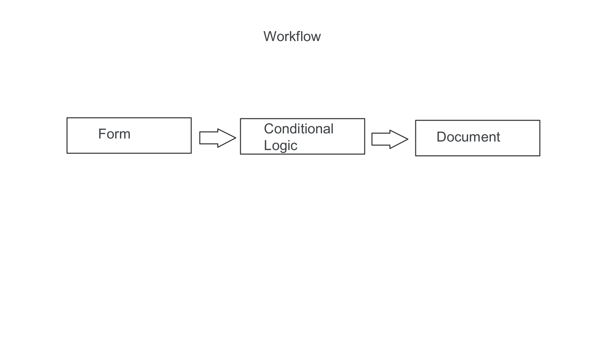

# contract-clause-generator

Federal Contract Clauses Generator: This application will generate federal contract clauses for supply purchases under Simplified Acquisition Procedures under $250,000. This application will automate and genreate contract clauses based on specific values and parameters entered by the contracting specialist or officer. Once the contract clauses are organized, they are written to a word document or PDF for the contracting specialist or officer to add to the federal contracting document.

## Vision

Federal Contract Clause Generator will end the long hours spent on genrating contracting clauses. What took hours and sometimes days to prepare federal contract clauses, will now take only minutes to genrate. This application will bring the federal proccurement process from the 20th century using static excel worksheets into the 21st century using a program that will end the need to copy and paste.

## Main Features & MVP

* Input: Form with prompting user input on contract specific information
* Logic will run thruough conditionals set for each clause
* Ouput: PDF or Word DOc with cluases prepared to be added to contracting document

## Limitations

* Disclaimer that contracting specialist or officer must review output document prior to inclusion to contract
* Document will only generate cluases for supply contracts under $250,000 and not apply to service contracts
* User will have to manually make ajustments to contract language after document is generated

## Flow

* User will open the application
* Form will appear for user
* User will fill out questions on form
* User will submit form
* The users document will appear in their desired directory location

## Basic Design Wireframe

### Input Form

### Output Clauses

### Workflow

